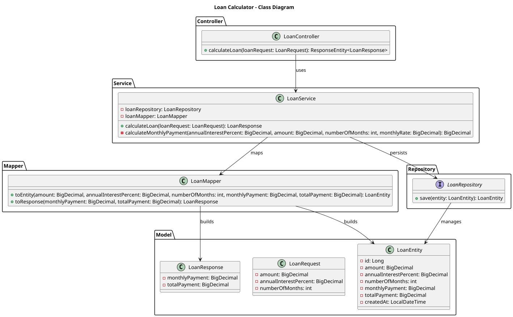
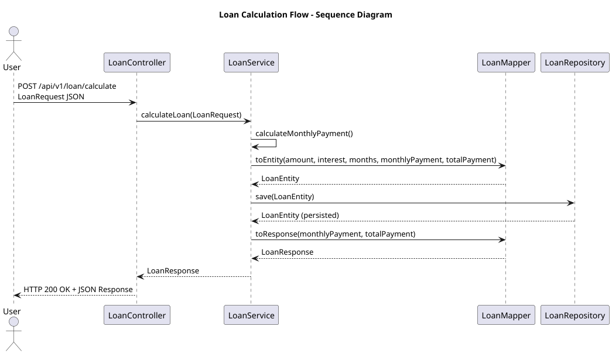

# Loan Calculator

A simple **REST API** built with **Spring Boot** that calculates monthly loan installment plans based on the loan amount, annual interest rate, and number of months.

---

## Overview

This application provides an endpoint that returns loan installment details — including monthly payment and total repayment amount.  
Each calculation request is stored in an in-memory H2 database for persistence.

---

## Formula Used

The monthly payment is calculated using the **amortization formula**:

M = P × [ r(1 + r)^n ] / [ (1 + r)^n – 1 ]

Where:
- **M** = Monthly payment
- **P** = Loan amount
- **r** = Monthly interest rate (`annualInterestPercent / 12 / 100`)
- **n** = Number of months

---

## API Documentation

This project includes API documentation using **Swagger UI**.

After starting the application, open:
👉 [http://localhost:8080/swagger-ui/index.html](http://localhost:8080/swagger-ui/index.html)

---

## UML Class Diagram

---

## Sequence Diagram

